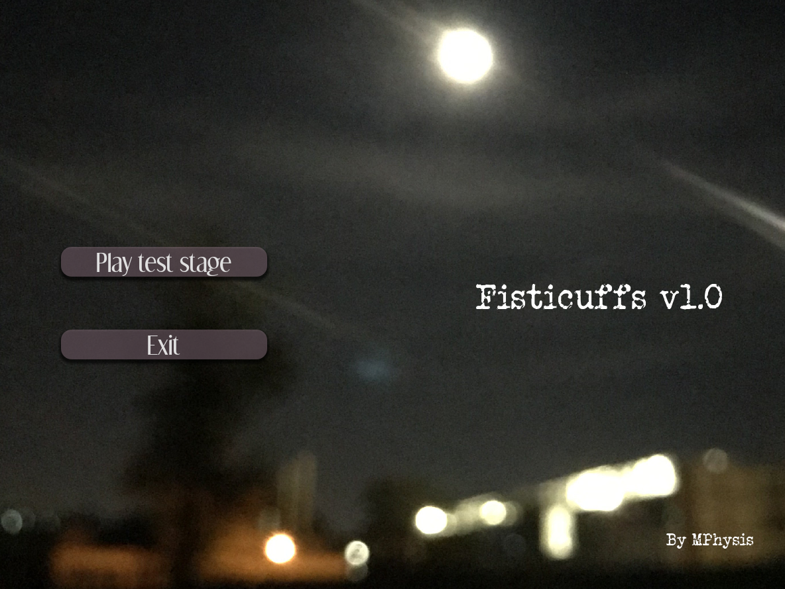
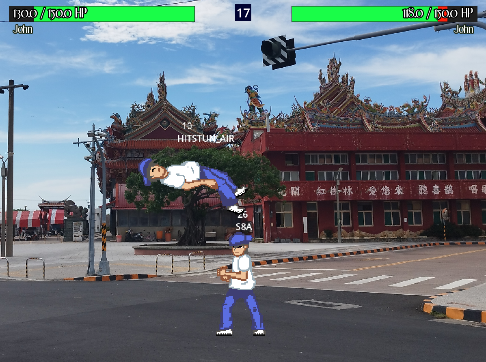

# Project repository for fisticuffs_v1.0.0

Solo(-ish) personal project of a 2D fighter. This is also a useful reference for godot game development, as fighting games are quite complex in terms of state machines.

- This project heavily follow the structure of the [godot platform fighter series](https://www.youtube.com/watch?v=FKMBkZsPCCA&list=PLeJDGeZe3by2tQIJmCZfaSRl95cot070t), on youtube.
- To implement more traditional fighter-like mechanics, **I differ from the tutorial greatly starting from the 5th video**
- This is a project in the making, very unfinished.

## Requirements and installing

- Clone the repository into a local directory
- Download **godot ver4.5 stable** for your OS: [download link](https://godotengine.org/download/archive/4.5-stable/)
  - Advantage of being very lightweight and portable
- From the godot executable, **import** the local directory of the project (`Ctrl+I`) and edit it (select then `Ctrl+E`)
  - This will re-import the assets into the godot project
  - This step is important otherwise some textures will not appear when just running the game directly
- Run the game from the godot game engine with `F5`. This will run the main menu, from which the test stage can be accessed.

## Sample images from the game (in development)

Title screen             |  Game footage
:-------------------------:|:-------------------------:
  |  

## Dimensions

- For now, keep 1200px width and 900px height, for a 4:3 ratio like [_Street Fighter 3 : Third Strike_](https://en.wikipedia.org/wiki/Street_Fighter_III:_3rd_Strike) and [*Melty Blood : Actress Again Current Code*](https://en.wikipedia.org/wiki/Melty_Blood)

## Game progression

- Single character with animations (John)
- Movement (running and walljumps), attack and hitstun states functionnal
- Player-to-Player pushing like in Street fighter (no ECB like in Smash. Bros. Melee)
- Basic healthbars
- Very basic intro menu

## Unit testing

- Consensus is that unit testing in games is time consuming and challenging 
	&rarr; **not worth the time investment** in this solo dev project

## TODO

- Navigate main menu using keyboard controls
- Add controls help (on sides of screen?)
- Add defensive mechanics (shield/block)
- Draw and implement updated animations
- Make UI add health bars according to the number of characters present.
- Shoot locations for stage backgrounds
